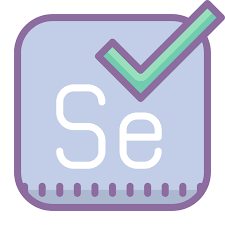

[![Contributors][contributors-shield]][contributors-url]
[![Forks][forks-shield]][forks-url]
[![Stargazers][stars-shield]][stars-url]
[![Issues][issues-shield]][issues-url]

<!-- PROJECT LOGO -->
<br />
<p align="center">
  <a href="https://github.com/KimDung726/Selenium2">
    
  </a>

<h3 align="center">Test Automation Framework</h3>

  <p align="center">
    This is an example of using Selenium test framework.
    <br />
    <a href="https://github.com/KimDung726/Selenium2">🖼 View Demo</a>
    ·
    <a href="https://github.com/KimDung726/Selenium2">📊 Report Bug</a>
    ·
    <a href="https://github.com/KimDung726/Selenium2">🛂 Request Feature</a>
  </p>

<!-- TABLE OF CONTENTS -->

## Table of Contents

1. [About The Project](#about-the-project)
    * [Built With](#built-with)
2. [Getting Started](#getting-started)
    * [Prerequisites](#prerequisites)
    * [Set up environment](#set-up-environment)
        - [Install Java 8](#install-java-8)
        - [Install dependencies](#install-dependencies)
3. [Usage](#usage)
4. [Contact](#contact)
5. [Helpful Docs](#helpful-docs)

<!-- ABOUT THE PROJECT -->

## About The Project

[![Website need testing][product-screenshot]](http://www.railway.somee.com/Page/HomePage.cshtml)

🌏 A Maven framework in which to build Selenium tests written in Java with Allure reports of test results.

### Built With

* [Java](https://en.wikipedia.org/wiki/Java_(programming_language)) - Language
* [TestNG](https://github.com/cbeust/testng) - Testing framework
* [Selenium](https://github.com/SeleniumHQ/selenium) - Automation framework
* [Allure](https://github.com/allure-framework) - Reporting framework
* [Maven](https://maven.apache.org/) - Dependency management
* [WebDriverManager](https://github.com/bonigarcia/webdrivermanager) - Local driver binary management

<!-- GETTING STARTED -->

## Getting Started

📖 This is an example of how you may give instructions on setting up your project locally. To get a local copy up and
running follow these simple example steps.


### Prerequisites

* [OS](https://www.microsoft.com/en-us/software-download/windows10) : Windows, recommended Windows 10
* [Browsers](https://www.jetbrains.com/idea/download/#section=windows) : Chrome latest or older, Firefox 46.0.1 or older


### Set up environment

- Install Java 8

- Install dependencies
1. CD to the project folder
2. Open CMD/terminal then type `./mvnw install`


<!-- USAGE -->

## Usage

🖥 Copy the repo into your local machine : 

   ```sh
   git clone https://github.com/KimDung726/Selenium2
   ```

1. Type to run test

   ```sh
   mvnw clean test
   ```
   
2. Generate report

   ```sh
   allure serve allure-results
   ```
   
📊 The test result locates in the test-output folder


<!-- CONTACT -->

## Contact

📱 Created by [Dang Thi Kim Dung](kimdung726@gmail.com) - feel free to contact me!


<!-- HELPFUL DOCS -->

## Helpful Docs

📑 [Xpath Cheatsheet](https://devhints.io/xpath)

📑 [Selenium: Locating Elements](https://selenium-python.readthedocs.io/locating-elements.html)

📑 [Selenium: Waits](https://selenium-python.readthedocs.io/waits.html)

[contributors-shield]: https://img.shields.io/github/contributors/KimDung726/Selenium2.svg?style=for-the-badge

[contributors-url]: https://github.com/KimDung726/Selenium2/graphs/contributors

[forks-shield]: https://img.shields.io/github/forks/KimDung726/Selenium2.svg?style=for-the-badge

[forks-url]: https://github.com/KimDung726/Selenium2/graphs/network/members

[stars-shield]: https://img.shields.io/github/stars/KimDung726/Selenium2.svg?style=for-the-badge

[stars-url]: https://github.com/KimDung726/Selenium2/graphs/stargazers

[issues-shield]: https://img.shields.io/github/issues/KimDung726/Selenium2.svg?style=for-the-badge

[issues-url]: https://github.com/KimDung726/Selenium2/graphs/issues

[license-shield]: https://img.shields.io/github/license/othneildrew/Best-README-Template.svg?style=for-the-badge

[license-url]:https://github.com/KimDung726/Selenium2/graphs/blob/master/LICENSE.txt

[linkedin-shield]: https://img.shields.io/badge/-LinkedIn-black.svg?style=for-the-badge&logo=linkedin&colorB=555

[product-screenshot]: doc/image/screenshot.png